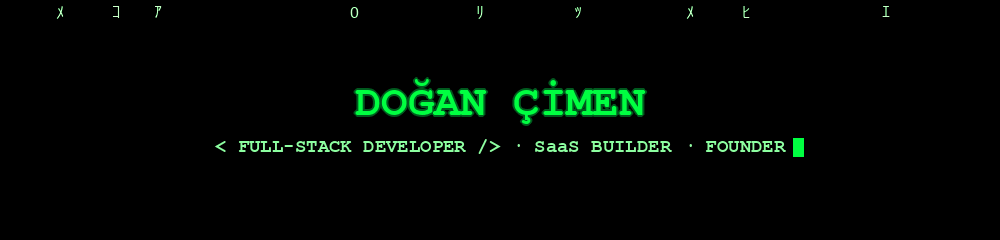

<!-- ===== Matrix Rain Banner (self-hosted, generated) ===== -->
<div align="center">
  
</div>

<!-- ===== Typing Animation ===== -->
<div align="center">

[](https://github.com/dogancmn)


</div>

<br/>

<!-- ===== Terminal About ===== -->
## 💻 `> initialize dogancmn.sys`

```console
dogancmn@thematrix:~$ whoami
Doğan Çimen — Full-Stack Developer · Founder @ Babillion · Project Lead @ Zamok

dogancmn@thematrix:~$ ls -la ~/achievements/
-rw-r--r--  tamir-yonet        → multi-tenant SaaS running in 350+ businesses
-rw-r--r--  zamoksign          → biometric e-signature platform
-rw-r--r--  zamokprice         → real-time auction engine (WebSocket)
-rw-r--r--  7_products_total   → designed, built, deployed & supported end-to-end

dogancmn@thematrix:~$ cat ~/.philosophy
Ship real products. Own the whole stack. Support real users.

dogancmn@thematrix:~$ curl -s https://api.dogancmn.dev/contact
{ "email": "dogangwd@gmail.com", "linkedin": "in/dogancmn", "status": "open_to_interesting_projects" }
```

> 🔵 **Blue pill:** close the tab, the story ends.&nbsp;&nbsp;&nbsp;🔴 **Red pill:** scroll down — and I show you how deep the rabbit hole goes.

---

## 🐇 Follow the White Rabbit — Featured Projects

> ⚠️ These are **showcase repositories** — all projects are live commercial products, so source code is kept private. Each repo contains a detailed technical write-up.

| Project | Description | Highlights | Status |
|---------|-------------|------------|:------:|
| 🔧 **[Tamir Yönet](https://github.com/dogancmn/tamiryonet-platform)** · [live](https://tamiryonet.com) | Multi-tenant SaaS repair-shop management platform | **350+ active businesses** · offline-first PWA · real-time sync · WhatsApp automation · marketplace price scraping | 🟢 Live |
| ✍️ **[ZamokSign](https://github.com/dogancmn/zamoksign-platform)** · [live](https://zamoksign.com) | Digital document signing platform | Biometric identity verification · encrypted storage · immutable audit trail · sequential signing workflows | 🟢 Live |
| 🚗 **[ZamokPrice](https://github.com/dogancmn/zamokprice-platform)** · [live](https://zamokprice.com) | Real-time vehicle auction platform | WebSocket live bidding · transparent bid history · trust-first marketplace | 🟢 Live |
| 🎮 **[ZamokGaming](https://github.com/dogancmn/zamokgaming-platform)** · [live](https://zamokgaming.com) | Subscription-based console rental service | Recurring billing · unit-level inventory · delivery logistics | 🟢 Live |
| 📊 **[Zamok Live](https://github.com/dogancmn/zamok-live)** · [live](https://zamok.live) | Enterprise productivity & reporting system | Workforce activity analytics · RBAC · privacy-conscious design | 🚧 In development |
| 📡 **[Zamok Amplifier](https://github.com/dogancmn/zamok-amplifier)** · [live](https://zamokamplifier.com) | Sales & support platform for LTE amplifier hardware | Hardware + software integration · e-commerce · support system | 🚧 In development |
| 🥬 **[Manav Evde](https://github.com/dogancmn/manavevde-platform)** · [live](https://manavevde.com) | Producer-to-consumer fresh produce e-commerce | Order management · freshness-driven delivery workflow | 🟢 Live |

---

## ⚡ `> loading skill_matrix.dll`

<div align="center">

### Frontend


### Backend & Database


### Architecture & DevOps


### Integrations & Security


</div>

---

## 📟 `> tail -f github_activity.log`

<div align="center">
  
  
  <br/><br/>
  
</div>

<br/>

<!-- ===== Contribution Snake (matrix palette — generated by snake.yml) ===== -->
<div align="center">
  <picture>
    <source media="(prefers-color-scheme: dark)" srcset="https://raw.githubusercontent.com/dogancmn/dogancmn/output/github-snake-dark.svg"/>
    <source media="(prefers-color-scheme: light)" srcset="https://raw.githubusercontent.com/dogancmn/dogancmn/output/github-snake.svg"/>
    
  </picture>
</div>

---

## 📡 `> establish_connection --secure`

<div align="center">

[](mailto:dogangwd@gmail.com)
[](https://linkedin.com/in/dogancmn)
[](https://github.com/dogancmn)

<br/>

<i>"I can only show you the door. You're the one that has to walk through it."</i> 🚪

</div>

<!-- ===== Footer ===== -->
<div align="center">
  
</div>
